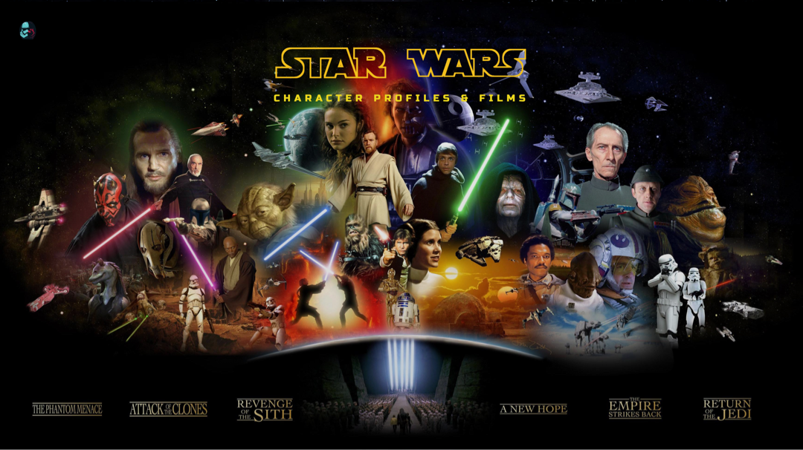

# Code the Dream Prework

### About the Project



This simple web page is created for submission to Code the Dream (https://codethedream.org/) as a prerequisite to acceptance into its August 11, 2021, React Class. The requirements for the project can be found here: https://codethedream.org/pre-work-for-advanced-classes/.

The web page is built with HTML, CSS and a JavaScript file that fetches data from the Star Wars API (https://swapi.dev/) and displays them on the page per requests submitted through the UI.

### Getting Started

To get a local copy up and running follow these simple steps.

#### Prerequisites

This project dose not require the installation of NPM or a server. It uses the Fectch API to fetch data and displays them on the page through JavaScript.

#### Installation

1. Clone the repo using HTTPS or SSH:

```
git clone https://github.com/Sanlung/ctd-prework.git
```

or

```
git clone git@github.com:Sanlung/ctd-prework.git
```

2. Load the index.html file in your browser.

### Usage

The web page has a simple user interface that consists of a selection box and clickable links in the display which the viewer may use to choose information they want to display. Initially, the viewer needs to select a Star Wars character from the selection box to view the character's profile. After that, the viewer may click on any links that appear on the page to the Star Wars _films_ and _characters_ to view the respective information, or the viewer may continue to choose from the selection box to view character profiles.

### Contact

Author: Chung Kao

Project Link: https://github.com/Sanlung/ctd-prework
